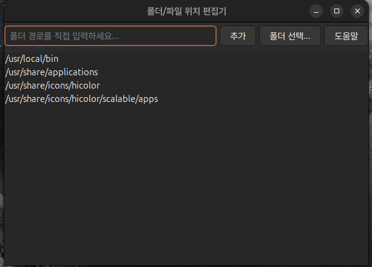
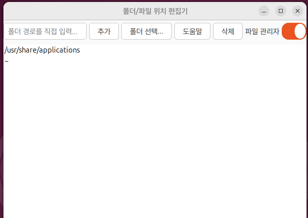

<!DOCTYPE html>
<html lang="ko">

</head>

<body>

  <!-- 이미지 두 개를 위쪽으로 배치 -->
  

    
  

  

    
  

  
<b>Folders for quick access. Click a path to navigate, or select a file to open it in gedit.</b>

  
<b>Using Ubuntu 24.04 environment, dependency: libgtk-3-0t64 (>= 3.24.41)</b>

  
<b>Compiled using gcc version 13.3.0</b>

  
<b>첫번째 folder1.0 압축 풀고 deb 파일 설치 후</b>

  
<b>두번째 수정 파일 업그레이드 파일 folder.zip 압축 풀면 실행 파일 생성</b>

  
<b>sudo mv -rf folder /usr/local/bin</b>

  
<b>삭제 기능 추가 및 관리자 폴더 이동 전용 스위치 추가</b>

  <a href="https://github.com/kj92001/folder/releases">
    GitHub Releases 바로가기
  </a>

  <a href="folder1.0.zip" download>📦 deb 파일 다운로드</a>
  <a href="folder.zip" download>🔧 패치 파일 다운로드</a>

</body>
</html>
